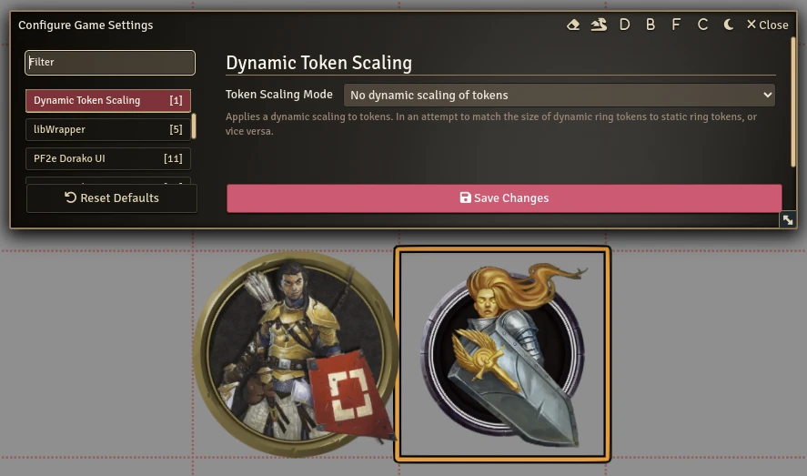
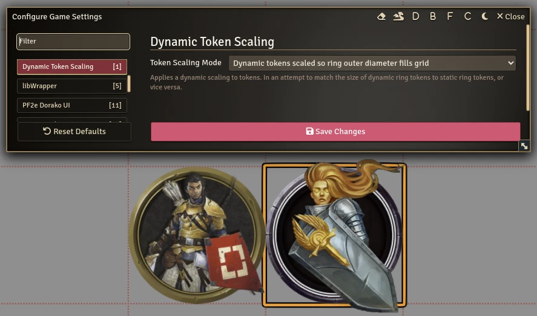
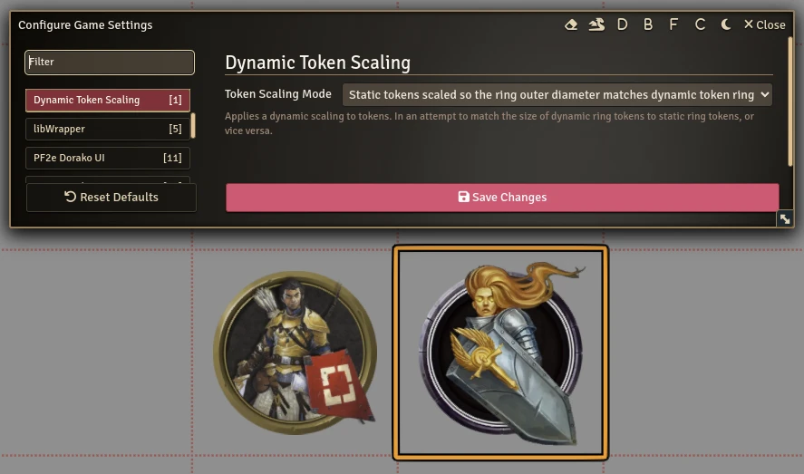

# Dynamic Token Scaling

This module will dynamically scale tokens.  It doesn't use the scale settings in
the token configuration.  Those still work as normal, this applies an additional
scaling on top of that.

The setting is per client, so that each user can choose based on their own
preferences.

It's intended to match the size of new dynamic ring style tokens to traditional
style static ring tokens.

In dynamic ring tokens, the inner diameter of the ring is 66% of the grid size
and the outer diameter is somewhat less than 100% of the grid size, depending on
the ring art.

In static ring tokens, the outer diameter of the ring is 100% of the grid size,
while the inner diameter varies with the ring art.

Both tokens at once look somewhat like this:

Tokens can be made consistent to the traditional style with this setting:

Or tokens can be consistent to the new standard of dynamic token rings:

